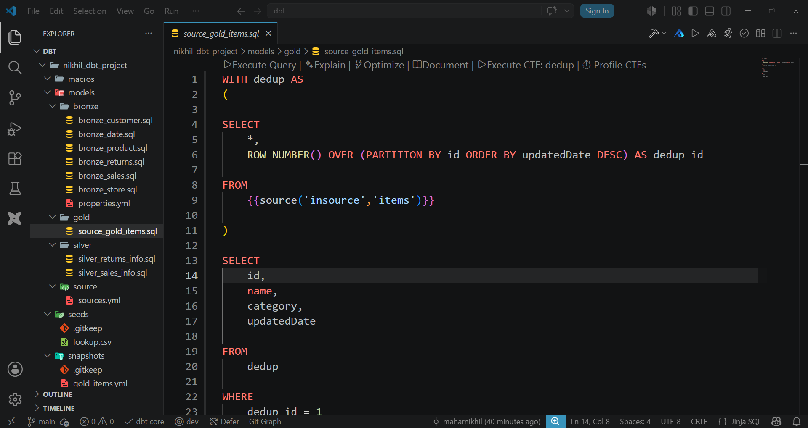
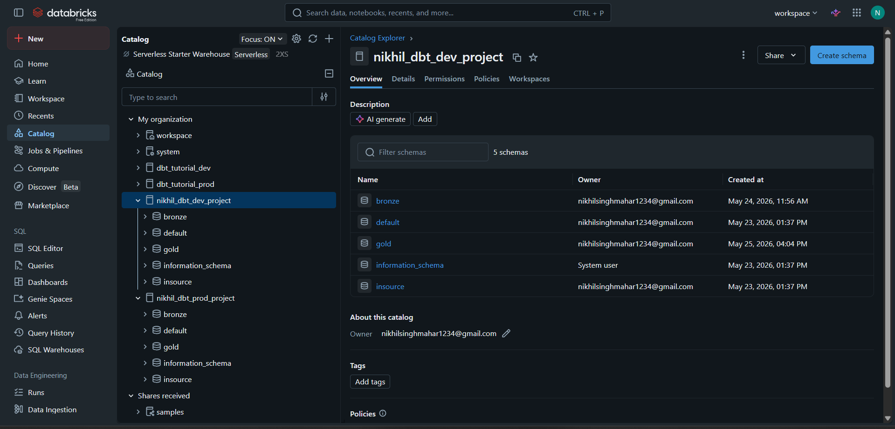

# dbt-databricks-dev-to-prod-pipeline

## Overview

This project demonstrates an end-to-end data pipeline built using **dbt** and **Databricks** following the **Medallion Architecture** (Bronze, Silver, and Gold layers). The pipeline ingests source data, performs transformations through multiple layers, applies data quality validations, tracks historical changes using snapshots, and supports deployment from Development to Production environments.

The project showcases modern Analytics Engineering and Data Engineering practices, including modular data modeling, automated testing, reusable macros, snapshot management, and environment-based deployment workflows.

---

## Project Architecture

```text
Source Data
    ↓
Bronze Layer
    ↓
Silver Layer
    ↓
Gold Layer
    ↓
Data Quality Validation
    ↓
Production Deployment
```

---

## Project Explanation

The source data is stored in Databricks and used as the foundation for the transformation pipeline.

### Bronze Layer

The Bronze layer contains raw ingested data with minimal transformations. It acts as the initial landing zone and preserves source-level information.

### Silver Layer

The Silver layer performs data cleansing, standardization, joins, and business logic transformations. This layer improves data quality and prepares datasets for downstream consumption.

### Gold Layer

The Gold layer contains curated business-ready tables generated from the transformed Silver layer data. This layer represents the final output of the pipeline.

---

## Features Implemented

### Data Modeling

* Bronze models
* Silver models
* Gold models
* Source definitions
* Modular dbt project structure

### Data Quality Testing

Implemented multiple data quality validations including:

* Not Null Tests
* Unique Tests
* Primary Key Validation
* Generic Custom Tests

These tests ensure:

* Critical columns do not contain null values
* Primary IDs remain unique
* Data integrity is maintained throughout the pipeline

### Reusable Macros

Custom dbt macros were created to improve code reusability and reduce repetitive SQL logic.

### Snapshots

Snapshots were implemented to track historical changes in data over time, enabling Slowly Changing Dimension (SCD)-style tracking and auditability.

### Environment Management

The project supports separate Development and Production environments using Databricks catalogs:

* Development Catalog
* Production Catalog

This enables safe development, testing, and deployment workflows.

### Dev-to-Prod Deployment

A complete Dev-to-Prod workflow was implemented, allowing transformations to be developed, validated, and promoted to Production in a controlled manner.

---

## Technologies Used

* dbt Core
* Databricks
* SQL
* Git
* uv
* Python

---

## Project Structure

```text

nikhil_dbt_project/
│
├── analyses/
│
├── macros/
│
├── models/
│   ├── bronze/
│   │   ├── bronze_customer.sql
│   │   ├── bronze_date.sql
│   │   ├── bronze_product.sql
│   │   ├── bronze_returns.sql
│   │   ├── bronze_sales.sql
│   │   ├── bronze_store.sql
│   │   └── properties.yml
│   │
│   ├── silver/
│   │   ├── silver_sales_info.sql
│   │   └── silver_returns_info.sql
│   │
│   └── gold/
│       └── source_gold_items.sql
│
├── source/
│   └── sources.yml
│
├── seeds/
│   └── lookup.csv
│
├── snapshots/
│   └── gold_items.yml
│
├── tests/
│   ├── generic/
│   │   └── generic_non_negative.sql
│   │
│   └── non_negative_test.sql
│
├── dbt_project.yml
└── README.md
```

---

## Screenshots

### dbt Project Structure

The dbt project contains layered models, tests, snapshots, seeds, and reusable macros.



### Databricks Catalog Structure

The project uses separate Development and Production catalogs with Bronze, Silver, and Gold schemas following the Medallion Architecture.



---

Developed using **dbt** and **Databricks** to demonstrate modern Analytics Engineering and Data Engineering.

## Author

**Nikhil Singh Mahar**

GitHub: `https://github.com/maharnikhil`

LinkedIn: https://www.linkedin.com/in/nikhilsinghmahar/

Mail: nikhilsinghmahar1234@gmail.com

---

## Project Status

-- Completed --
